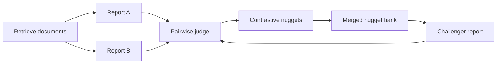

# Preference-Learning RAG

An iterative retrieval-augmented generation system that combines **CRUCIBLE** (nugget-first cited report generation) and **PrefNugget** (pairwise judging and contrastive nugget extraction). The two methods are usually run independently; this repository closes the loop so preference feedback improves the next report.

Evaluation uses **TREC RAGTIME 2026** (Tier B). Documents are retrieved through the RAGTIME Search API, so a local copy of the corpus is not required.

[Python 3.11+](https://www.python.org/downloads/)
[License: MIT](LICENSE)
[Package manager: uv](https://docs.astral.sh/uv/)

[Symposium poster (PDF)](documents/final_symposium_poster.pdf)

---

## Method

CRUCIBLE produces a cited report from a request-derived nugget bank. PrefNugget compares two reports, then extracts questions the winner answered more completely than the loser. Those contrastive nuggets are merged into the bank and used to generate a challenger. The process repeats until convergence.




| Round | Procedure                                                                                                           |
| ----- | ------------------------------------------------------------------------------------------------------------------- |
| 0     | Generate two reports (abstractive and extractive), judge them, and extract contrastive nuggets.                     |
| 1+    | Merge nuggets, generate one challenger, judge it against the current champion, and extract new contrastive nuggets. |


The loop stops when it reaches the configured round limit, when no new nuggets appear for several rounds, or when the same champion is selected repeatedly (`research/convergence.py`).

The working hypothesis is that preference-discovered nuggets cover facets a single-pass generator misses, which should raise gold-nugget coverage and citation quality relative to one-shot CRUCIBLE and a query-only baseline.

---

## Architecture

`crucible/` and `prefnugget/` do not import each other. `research/` is the only package that orchestrates both.


| Package          | Responsibility                                                                           |
| ---------------- | ---------------------------------------------------------------------------------------- |
| `rag_framework/` | OpenRouter LLM client, RAGTIME Search API, document and query models                     |
| `crucible/`      | Request nuggets, supported-answer extraction, cited report assembly, citation refinement |
| `prefnugget/`    | Pairwise ranking, contrastive nugget extraction, 0–5 nugget grading                      |
| `research/`      | Preference-learning loop, convergence criteria, five-system RAGTIME benchmark            |
| `experiments/`   | YAML configs for the loop and the benchmark                                              |
| `examples/`      | Command-line entry points                                                                |
| `scripts/`       | Dataset setup and document-cache warming                                                 |


### Benchmark systems

All five systems receive the same topics and retrieved documents.


| System                   | Description                                                          |
| ------------------------ | -------------------------------------------------------------------- |
| `preference_loop_full`   | Proposed method: full iterative loop                                 |
| `preference_loop_1round` | Ablation: dual reports and contrastive nuggets, no challenger rounds |
| `crucible_dual_best`     | Best of the round-0 pair, without further iteration                  |
| `crucible_single`        | One-pass CRUCIBLE using request nuggets only                         |
| `vanilla_rag`            | Query-only nuggets with single-pass extraction                       |


---

## Setup

Requirements: Python 3.11+, [uv](https://docs.astral.sh/uv/), an [OpenRouter](https://openrouter.ai/) API key, and TREC RAGTIME Search API credentials.

```bash
uv sync
cp .env.example .env
source .venv/bin/activate
python scripts/setup_ragtime_benchmark.py
```

Environment variables (see `.env.example`):


| Variable                                | Description                                              |
| --------------------------------------- | -------------------------------------------------------- |
| `OPENROUTER_API_KEY`                    | OpenRouter API key                                       |
| `OPENROUTER_MODEL`                      | Model identifier                                         |
| `RAGTIME_API_URL`                       | RAGTIME search endpoint assigned after TREC registration |
| `RAGTIME_BEARER_TOKEN`                  | RAGTIME bearer token                                     |
| `RAGTIME_PIPELINE`                      | Search pipeline alias (default `ragtime1`)               |
| `RAGTIME_COLLECTION`                    | Document collection alias (default `ragtime1`)           |
| `BENCHMARK_DRY_RUN` / `RAGTIME_DRY_RUN` | Set to `true` to skip HTTP calls                         |


Benchmark data under `data/` and run artifacts under `output/` are gitignored. `scripts/setup_ragtime_benchmark.py` downloads topics and qrels from NIST. Gold nuggets are converted from the RAGTIME score-release tarball when that archive is available. Expected layout:

```
data/benchmark/ragtime25/
  topics/ragtime25_main_eng.jsonl
  qrels/2025.mlir.qrels
  gold_nuggets/gold_nuggets.jsonl
  manifests/assessed_topics.json
  cache/{topic_id}.json
```

`cache/` is optional. Populate it without OpenRouter calls:

```bash
python scripts/warm_ragtime_cache.py --config experiments/benchmark_ragtime_poster.yml --max-topics 3
```

---

## Running experiments

Dry-run (writes a run plan; no API calls):

```bash
python examples/run_benchmark.py --config experiments/benchmark_ragtime_live.yml
```

Live benchmark on three short topics, all five systems:

```bash
python examples/run_benchmark.py --config experiments/benchmark_ragtime_live.yml --live
```

Live benchmark on ten assessed topics (poster configuration):

```bash
python examples/run_benchmark.py --config experiments/benchmark_ragtime_poster.yml --live
```

Single-topic preference loop:

```bash
python examples/run_preference_loop.py --config experiments/preference_loop.yml
```

Loop and benchmark hyperparameters are defined in `experiments/*.yml`.

---

## Evaluation

For each system and topic, the harness records:


| Metric                | Definition                                                    |
| --------------------- | ------------------------------------------------------------- |
| Gold nugget coverage  | Fraction of RAGTIME gold questions graded ≥ 4                 |
| Gold mean / max grade | PrefNugget 0–5 coverage of the gold rubric                    |
| Query-only coverage   | Coverage of generic query-only nuggets (ablation)             |
| Citation coverage     | Fraction of report sentences that carry a citation            |
| Citation validity     | Fraction of citations that resolve to a retrieved document ID |
| RAGTIME F1 proxy      | Harmonic mean of gold coverage and citation validity          |
| Pairwise win rate     | Rate at which the full loop is preferred over each baseline   |


Results are written to `output/benchmark/{benchmark_id}/`:

```
runs/{system}/{topic_id}.json
eval/scores.json
eval/summary_table.md
poster/poster_summary.md
poster/figures/*.png
```

Rebuild tables and figures from saved scores:

```bash
python examples/generate_poster_assets.py --config experiments/benchmark_ragtime_poster.yml --report
```

---

## Related work


| Paper                                        | Use in this project                                                       |
| -------------------------------------------- | ------------------------------------------------------------------------- |
| CRUCIBLE (ECIR 2026)                         | Nugget-first cited report generation                                      |
| PrefNugget / Too Many Questions (SIGIR 2026) | Contrastive nuggets derived from pairwise preferences                     |
| Insider Knowledge (ECIR 2026)                | Motivation to report gold coverage separately from system-nugget coverage |


This implementation is the closed generation–evaluation loop those papers leave as future work.

---

## License

Released under the [MIT License](LICENSE). Copyright (c) 2026 Aaryan Patel.